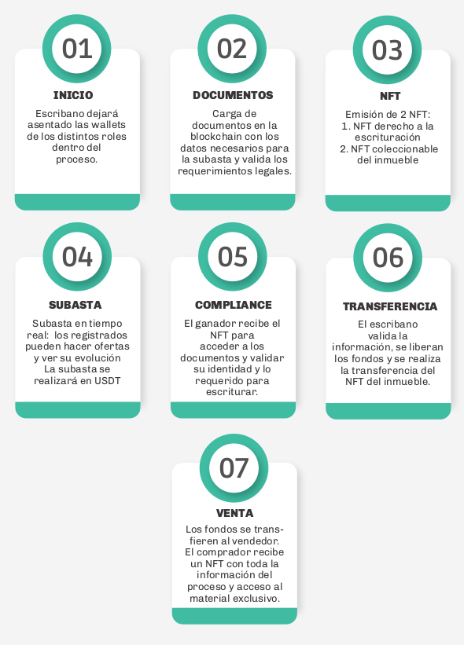

# TOKENFIT

## Introducción

### ¿Qué es el proyecto TOKENFIT?

El proyecto investiga la Tokenización de activos y su venta utilizando tecnología blockchain en el marco de la normativa argentina. TOKENFIT quiere impulsar la adopción de tecnología blockchain acelerando la conjunción del sector de Real Estate con los nuevos modelos de negocios basados en Web 3.

TOKENFIT realizará la primera experiencia de venta de un inmueble en Argentina utilizando íntegramente tecnología Blockchain. Esto generará precedentes en un camino sin explorar, probando límites y necesidades del sistema jurídico y tecnológico argentino con el objetivo de contribuir a una adecuada regulación para el desarrollo de nuevos modelos de negocios.&#x20;

En su primera etapa, TOKENFIT es una DApp (Descentralized App) de desarrollo propio que permite realizar la venta de un departamento íntegramente con tecnología Blockchain, garantizando la legalidad del proceso mediante el uso de Smart Contracts y NFTs.&#x20;

Esta experiencia contará con 4 instancias principales: digitalización, inscripción, subasta y escritura. Los interesados en adquirir el inmueble podrán realizar su pre-inscripción mediante nuestra DApp y participar de la subasta. El ganador accede a la fase de escritura.&#x20;

Las transferencias de los fondos serán automatizadas y aseguradas por los Smart Contracts. La subasta se hará en criptomoneda estable USDT y todo el proceso de venta estará acompañado por un escribano, quien actuará como autoridad certificante (oráculo) mediante la autenticación (o validación) de los pasos, a través de su wallet y cumpliendo la función de cargar la documentación.

Concluida la subasta, el token que representa al inmueble se convertirá en un NFT coleccionable propiedad del comprador.&#x20;

La Prueba de Concepto (POC - Proof Of Concept) para la venta mediante subasta será una experiencia de única vez y los datos obtenidos darán inicio al desarrollo de las próximas etapas de TOKENFIT como una plataforma orientada a la tokenización.

## Aviso Legal

### **Disclaimer**

El proyecto TOKENFIT consiste en una prueba de concepto, de manera que es de carácter experimental, fue desarrollado sobre la base del conocimiento de la tecnología blockchain y el derecho de fondo y de forma. Este documento no pretende ser un análisis exhaustivo ni brindar asesoramiento legal, técnico ni regulatorio. Si bien toda la información que contiene, así como los puntos de vista vertidos, son brindados de manera diligente y de buena fe, TOKENFIT no asume obligación ni responsabilidad alguna por cualquier error y/o inexactitud que pueda contener. Asimismo tampoco se obliga a brindar mayor información y/o a ampliar datos o fuentes a los destinatarios.&#x20;

Al tratarse de una prueba de concepto sin antecedente conocido de un proyecto similar en la República Argentina, al menos por quienes han desarrollado el presente, TOKENFIT no garantiza que los resultados reales sean consistentes con el proyecto planteado. Los organismos administrativos que resulten competentes en el desarrollo de la prueba de concepto no han examinado la información incluida en este documento. Es por ello que cualquier obstáculo u observación que pudiera formularse en cualquiera de las etapas de su ejecución obedece a que el mismo se encuentra en etapa experimental y no es responsabilidad de los desarrolladores. Este documento no implica oferta ni invitación a contratar, no obliga a TOKENFIT con los destinatarios. En el caso de la subasta, el acuerdo se realizará entre el titular registral del inmueble y el adquirente en subasta, se regirá exclusivamente por documentos separados y por los términos y condiciones que figuran en el sitio web tokenfit.io. En caso de que exista contradicción y/o inconsistencia entre lo establecido en este litepaper y los términos y condiciones del sitio web, prevalecerán estos últimos. La tecnología blockchain al igual que los avances de la tecnología en general pueden presentar riesgos e incertidumbres, la volatilidad de algunas criptomonedas y otras condiciones de esta industria hacen aconsejable que toda persona que esté dispuesta a invertir y/o participar de experiencias en el mundo blockchain, deba informarse previamente de los riesgos y costes asociados. TOKENFIT no se hace responsable por variaciones y/o pérdidas en el valor de criptoactivos que sean utilizados como seña y/o como pago total de la oferta, fees u otros. La DApp que desarrollará TOKENFIT puede variar con relación a lo descrito en este litepaper o bien puede fracasar por varias razones, entre ellas la falta de financiación, la falta de éxito comercial y factores externos, entre otros, sin que la presente pueda ser considerada como una descripción taxativa.

## **Sobre qué es BlockChain**

### Blockchain

Es una tecnología basada en una cadena de bloques con una base de datos pública y distribuida en la que se registran de forma segura las transacciones que se van realizando en la red.

### **Tokens**

Un token es la representación digital de un objeto físico o digital que tiene valor en cierto contexto o para determinada comunidad, aunque su propia materialidad no contenga ese valor en sí. El funcionamiento del token depende de una blockchain y una criptomoneda que permitan desarrollar el token. Además requiere de un contrato o programación que deje en claro todo lo que se puede hacer y no se puede hacer con el token.

### Web 3

Tercera generación de Internet donde los sitios web y las aplicaciones podrán procesar información de una manera inteligente similar a la humana a través de IA y tecnología de contabilidad descentralizada (DLT por sus siglas en inglés). Los datos se interconectan de manera descentralizada, además los usuarios y las máquinas podrán interactuar con estos datos.

### **Wallets**

El término wallet hace referencia a una cartera, billetera o monedero virtual en el que podemos gestionar nuestras criptomonedas. Siendo claros, es un espacio donde guardas tus claves, de las cuales puedes acceder a la blockchain donde se registran tus cripto.

## **Propósito**

Queremos ser precursores e incentivar en nuestro país la adopción de tecnología blockchain. Transparencia, descentralización y accesibilidad son objetivos con los que queremos colaborar.

TOKENFIT es la primera experiencia de venta de un inmueble en la Argentina íntegramente utilizando tecnología blockchain. Generar estos primeros antecedentes es el inicio correcto para abrir nuevos caminos en la modernización.

Esta DApp de Tokenización desarrollada íntegramente por nuestro equipo es el primer paso en un segmento nuevo, sin precedente en esta modalidad, dirigido hacia una nueva economía de los bienes en donde las partes puedan realizar operaciones de forma segura y eficiente.

Somos argentinos, profesionales innovadores y apasionados colaborando con el crecimiento sin fronteras de la tecnología en nuestro país y el mundo entero.

## La experiencia

En la primera etapa del proyecto, nos proponemos realizar una experiencia única en donde realizaremos la venta completa de un inmueble todo gestionado íntegramente por nuestra DApp, incluyendo la trazabilidad de todos los documentos, el estado de la transacción y el movimiento de fondos de una manera segura, transparente y automatizada mediante el uso de Smart Contrats y NFTs.&#x20;

## Paso a paso

### **Instancia de DIGITALIZACIÓN**

* Duración: 30 días
* Actores: Escribano + Vendedor&#x20;
  *   El escribano autenticado mediante su Wallet carga los documentos, las aprobaciones necesarias para realizar la venta y los datos para que el vendedor reciba el pago. Nuestra DApp registra todo en la BlockChain BNB Chain (ex Binance Smart Chain)

### **Instancia de INSCRIPCIÓN**

* Duración: 5 días
* Actores: Compradores interesados + Escribano&#x20;
  * Los interesados en participar de la subasta realizan un OnBoarding de sus datos en nuestra DApp y un KyC inicial. Las wallets validadas y aceptadas por el escribano en esta instancia serán las que podrán acceder a la subasta.

### **Instancia de SUBASTA**

* Duración: 5 Horas
* Actores: Compradores registrados&#x20;
  * Las wallets registradas durante la Inscripción podrán participar del proceso de subasta mediante la transferencia de la seña en USDT utilizando nuestra DApp. Nuestros Smart Contracts resguardarán siempre la mejor oferta devolviendo las inferiores automáticamente a los oferentes.&#x20;
  * Cumplido el tiempo de Subasta, la oferta mayor, previa transferencia total de los fondos y gastos de transferencia, recibirá un NFT que le dará acceso a la etapa de Escrituración.

### **Instancia de ESCRITURACIÓN**

* Duración: 5 días&#x20;
* Actores: Comprador ganador + Escribano&#x20;
  * El ganador de la subasta recibirá un token NFT que le permitirá acceder a la etapa de escrituración.&#x20;
  * Deberá ingresar toda la información necesaria para validar y completar los requisitos legales de la venta y el escribano realizará las verificaciones e informes necesarios.&#x20;
  * Cuando el escribano dé por aprobada la venta, los fondos se transferirán automáticamente al vendedor y los gastos de escrituración al escribano. El comprador recibirá un NFT coleccionable con toda la información del proceso y acceso al material exclusivo.

## **Diagrama del proceso**

## **NFT coleccionable**

Luego de la subasta el token que representa al inmueble durante el proceso de venta se convertirá en un NFT coleccionable con todo el legajo administrativo y periodístico del proceso y proyecto, así como las fotos del inmueble realizadas por un importante artista de Rosario, y la escritura traslativa de dominio. El comprador podrá luego comercializarlo y en todo momento el tenedor del token tendrá acceso al material exclusivo del proceso en la plataforma TOKENFIT.

## **Lo disruptivo**

En la compra de un inmueble participan múltiples intermediarios y se llevan a cabo procedimientos burocráticos que consumen tiempo y altos costos. Se invierte mucho más tiempo que el necesario para comprar una acción bursátil.

Hoy resulta posible trasladar la liquidez del mercado financiero al Real Estate mediante la tokenización. Se puede generar un token y asociar el valor del inmueble con ese token. Luego ese token se comercializa en la blockchain y puede ser adquirido por cualquier persona en cualquier parte del mundo, cualquier día de la semana, a cualquier hora. A esto lo llamamos “efecto token”. El mundo avanza en este sentido.

Queremos que Argentina se incorpore a la lista de los países que adhieren y fomentan el efecto token o la token economy.

## **La experiencia desde lo legal**

Se estima que en unos años la mayor parte de la economía estará tokenizada. Existen muy pocas experiencias desarrolladas en el mundo, al día hoy, en las cuales se intentó realizar una aproximación a la tokenización de inmuebles, pero en rigor de verdad se trató de una tokenización de participaciones societarias de una entidad jurídica titular del inmueble, es decir que no hubo transferencia de inmueble, en sentido estricto, sino compra de participaciones societarias.&#x20;

En cambio, el esquema planteado por TOKENFIT difiere de todo lo anterior e implica la transferencia dominial del inmueble al adquirente del token en subasta, no de las participaciones societarias de una entidad titular del inmueble.&#x20;

La Web 3, que incorpora la tecnología blockchain, implica la transferencia de valor de manera inmediata. Las características intrínsecas de esta tecnología permiten acortar tiempos y realizar operaciones comerciales seguras, trazables, públicas, de bajo costo y desde cualquier lugar del mundo.&#x20;

La doctrina mayoritaria en nuestro país considera que las anotaciones sobre blockchain encuadran dentro del concepto de documento digital con firma electrónica, en los términos de los artículos 5 y 6 de la Ley Nº 25.506 de Firma Digital. En este sentido los Smart Contracts serían una modalidad dentro de los contratos electrónicos válidos (art. 284, 286 y 288 Código Civil y Comercial), salvo para el caso de los contratos formales en los cuales el incumplimiento de ciertos formalismos determinan su nulidad.&#x20;

Para el caso de venta de un inmueble, la normativa argentina prevé que la transferencia dominial debe ser realizada a través de un contrato solemne. Este requisito esencial (escritura pública) dificulta la celeridad y flexibilidad de las operaciones. Si bien hoy en día casi todos conocen el término criptomoneda o bitcoin , en rigor de verdad poco se conoce de la potencialidad de la tecnología blockchain o DLT como punto de partida para nuevos modelos de negocios.

En la Argentina, la CNV (Comisión Nacional de Valores) conformó en el año 2019 una mesa de análisis para las nuevas tecnologías, no obstante aún no ha dictado ninguna regulación al respecto**.**

Al momento de la redacción de este litepaper, existen tres proyectos de ley que aún no han tenido tratamiento parlamentario. Queremos ser precursores en el camino que posicione a nuestro país como pionero, coadyuvando a la adopción de esta tecnología que impactará en el mundo entero y transparentará los procesos, de manera que puedan ser verificados por un ecosistema descentralizado y por todos los ciudadanos.

## **Nuestro Sponsor**

Próximamente te contaremos quien es nuestro Sponsor y cuales son las características del inmueble con el que realizaremos la experiencia.

La experiencia cuenta con un importante sponsor que se suma al proyecto TOKENFIT y aportará el primer inmueble que será subastado utilizando nuestra DApp blockchain.&#x20;

Se trata de una compañía con un fuerte espíritu innovador que ha incorporado a la tecnología como herramienta clave en sus proyectos. Con muchos años de trayectoria y un sinfín de desarrollos exitosos en el país y en el exterior, se suma a TOKENFIT para aunar objetivos y que juntos nos adentremos en la vanguardia de los modelos de Real State en la Argentina.

## **Ficha del inmueble**

(Pendiente)

## **Roadmap**

Tokenfit hoy se propone materializar la primera venta de un inmueble (transferencia dominial) utilizando íntegramente tecnología de cadena de bloques. En sus siguientes etapas, luego de capitalizar la experiencia generada, nuestro objetivo es evolucionar nuestra DApp dirigiéndonos a producir una plataforma de servicios para el sector de Real Estate:

## **Debajo del capot** 

La DApp TOKENFIT está diseñada y construida utilizando los estándares de vanguardia en el mercado. Las tecnologías de cadenas de bloques son un ámbito de innovación continua en donde todos los días se crean nuevas soluciones. Nuestro equipo ha diseñado una arquitectura que implementa Smart Contracts, Tokens y NFTs para modelar el flujo de todo el proyecto.&#x20;

Alojada en la red BNB Chain (ex Binance Smart Chain), nuestra arquitectura de Smart Contracts gestiona todo el flujo de aprobación y transferencias de Fondos entre las Wallets.&#x20;

Una capa externa (FrontEnd) desarrollada en Vue.js es la encargada de interactuar con la blockchain y las wallets (Metamask). La capa de servicios (BackEnd) desarrollada en Node.Js es la encargada de gestionar la interacción con los archivos, dar soporte de Base de Datos, realizar los procesos de encriptación de los documentos privados que luego serán alojados en un servidor descentralizado y registro de roles requeridos para determinar las acciones que pueden realizar los distintos actores y permisos para visualizar la información.&#x20;

La documentación del proceso es almacenada mediante el servicio IPFS (peer-to-peer hypermedia protocol) y los accesos son gestionados utilizando validaciones de Wallets y Roles.

## **Diagrama de componentes**

.png>)

## **El equipo**

TOKENFIT propone revolucionar los modelos tradicionales de la industria inmobiliaria mediante la tecnología blockchain; transparente y segura.

Somos un  equipo de desarrolladores y analistas legales argentinos, apasionados por impulsar la tecnología blockchain en Real Estate.&#x20;

Nuestro propósito es generar la primera experiencia de subasta de un inmueble íntegramente en la blockchain, para que sea un antecedente al crecimiento de nuevos modelos de negocio descentralizados, rápidos y seguros en nuestro país y el mundo entero.

|                                                      |                                                                                                                                                             |
| ---------------------------------------------------- | ----------------------------------------------------------------------------------------------------------------------------------------------------------- |
|  | Estudio jurídico/contable, integrado por profesionales del derecho y las ciencias económicas, con amplia experiencia y especialización en temas empresarios |
|                        | Tecnología de programación sustentable para finanzas                                                                                                        |

